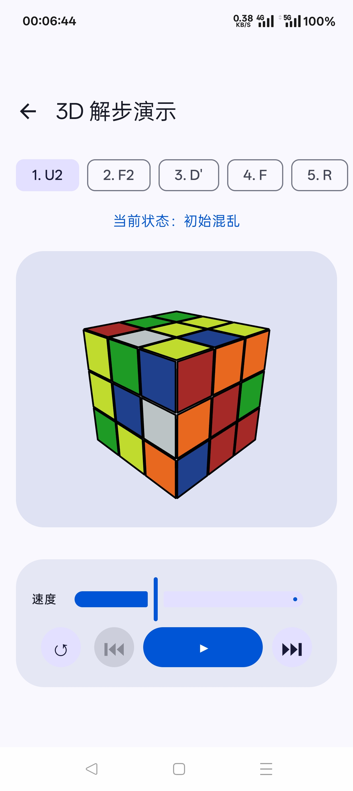
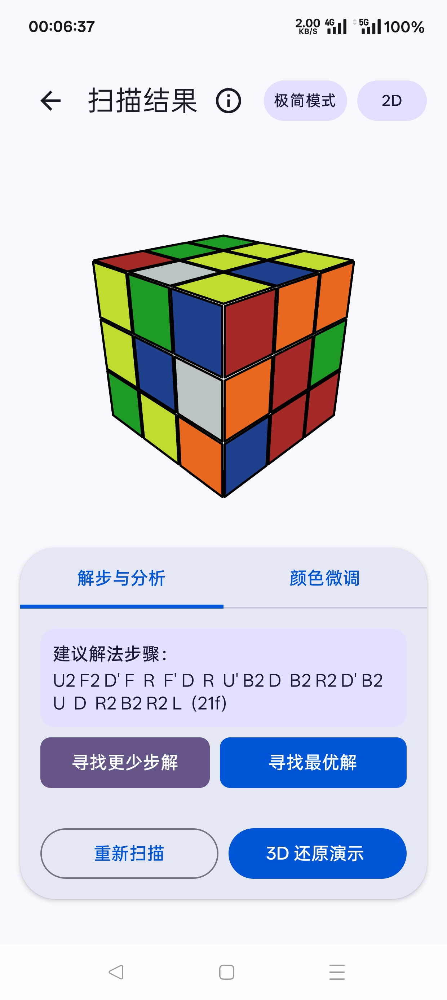
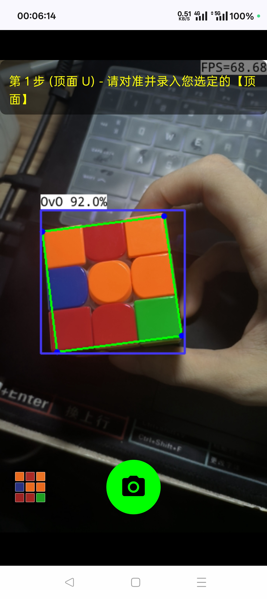
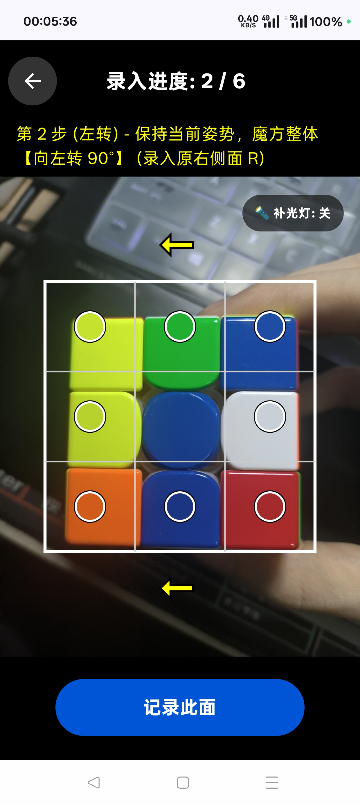
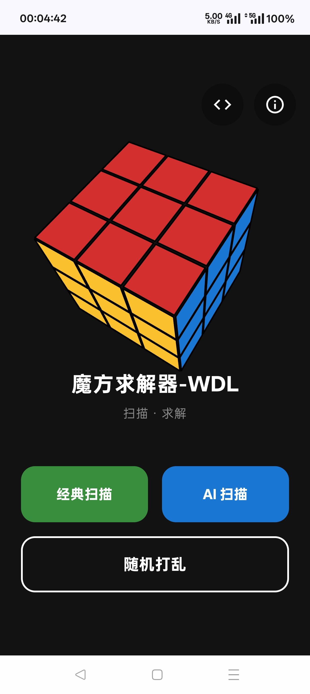

# 魔方求解器

这是一个基于 Android 平台开发的三阶魔方识别与还原工具。项目支持相机常规扫色、基于 YOLOv8-NCNN 的 AI 扫描识别（300 张魔方图片训练的小模型），支持 3D 还原步骤演示。

---

## 📸 应用截图 (Screenshots)

<table>
  <tr>
    <td></td>
    <td></td>
    <td></td>
    <td></td>
    <td></td>
  </tr>
  <tr>
    <td align="center"><b>主界面</b></td>
    <td align="center"><b>AI 扫色</b></td>
    <td align="center"><b>多状态比对</b></td>
    <td align="center"><b>控制台与微调</b></td>
    <td align="center"><b>3D 演示播放</b></td>
  </tr>
</table>

*(注：您可以在 3D 播放器中通过单指滑动旋转整体视角，双指旋转平面视角，双击重置默认视角。)*

---

## ⚖️ 参考与致谢

参考并集成了以下优秀项目：

* **[min2phaseCXX](https://github.com/lilborgo/min2phaseCXX)** (GPL-3.0 License) - 核心双阶段求解算法
* **[ncnn-android-yolov8](https://github.com/nihui/ncnn-android-yolov8)** (BSD-3-Clause / MIT License) - 移动端 YOLOv8 部署参考
    * *其中集成的 Tencent NCNN 推理部分版权归属如下：*
  > Copyright (C) 2021-2024 THL A29 Limited, a Tencent company. All rights reserved.
  > Licensed under the BSD 3-Clause License.